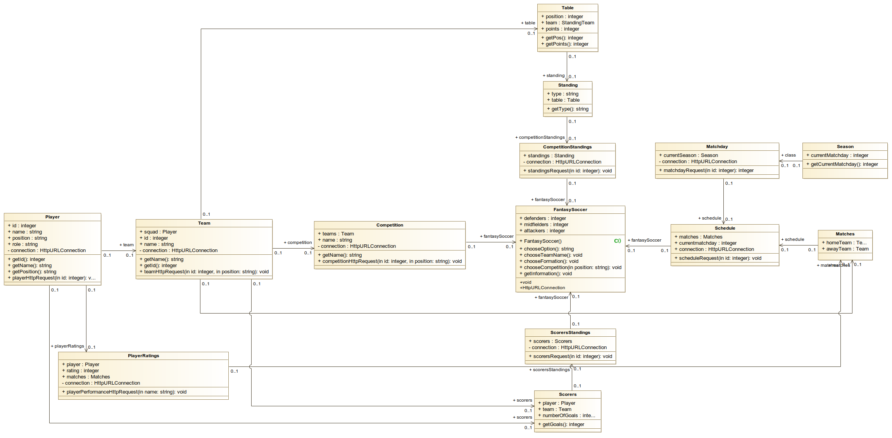

# Assignment 3

# Summary of changes of Assignment 2

- changed the names of classes, functions and attributes to be more descriptive

- made a special class for all the HTTP request

- address the issues with Assignment 1

- address the issues with the Class digram, such as the multiplicity, the missing associations, missing classes and wrong names

- address the issues with the Object diagram and improve it by adding a more in depth example

- changed the state machine diagram as it was more a activity diagram

- improve the sequence diagram by adding the missing parts such as the guards

- the grammar issues have been solved

- the functions of the entire system have been reduced and grouped accordingly

- the list of quality requirements has been extended

- the format of the Team Formation has been changed accordingly, and the user has a wider spectrum of possible format

- the structure and protocol of the UML designs has been changed to follow the UML design conventions

  

# Class Diagram

Authors: Daniel, Radu

In software engineering, a class diagram in the Unified Modeling Language (UML) is a type of static structure diagram that describes the structure of a system by showing the system's classes, their attributes, operations (or methods), and the relationships among objects.

### **Class FantasySoccer**

The class diagram, shown in Fig 1, is centered around the **FantasySoccer class**, which represents the entire application. The only attributes that this main class has are the number of *defenders, midfielders and attackers*, which is the most important factor in creating the desired team, those attributes are public and of type integer. Those attributes are used later in the process of creating the team, by selecting the desired team formation (e.g 4-4-2, 4-3-2-1, etc).

The operations of the main component class of the diagram, **FantasySoccer**, representing the methods/functions that can be performed by an instance of a class or interface.

Firstly, in order to understand the purpose and scope of each operation, we will briefly explain chronologically each operation as they are encountered and implemented. The first operation is *chooseOption()*, which represents the two possible states of the application. The first state is the state when the client/user has to create the desired team and the second state is when the client/user has the possibility to get information about the Standings, the Top Scorers or the Standings of one of the available Competition from the API. 

## Create Team section

This operation is of type String, a string value which will be returned and used when an instance will be created by using the constructor *~FantasySoccer(),* every other operation is of type void, no values needed to be returned, only operations to be done in the instance of the app. The second operation is *chooseTeamName()*, which is self-explanatory. This operation represents the mandatory step that needs to be taken by the user when the option to create a team, was selected, which is to choose a team name for the “Fantasy Team”. The next operation is *chooseFormation()*, which represents the requirement of the user to select one of the possible displayed team formations (e.g 4-4-2, 4-3-2-1, etc), that will be used in order to create the team. Therefore, after the formation has been selected, the attributes corresponding with this formation will be assigned with the values inserted by the user. For instance, if the user chooses the most widely used formation of 4-4-2, the attribute defenders will equal 4, midfielders equal 4, and the number of attackers will be equal to 2, error-handling is also present in our implementation, meaning that whenever the user chooses an unknown formation, the operation of selecting the team formation will be looped until the user choose a valid formation for his team. For the next operation of the class, we have *chooseCompetition(),* which will have a parameter on String value representing the position of the selected player that will be checked in the specific competition, for instance after the user will choose the Competition Serie A, and the Team Juventus, and the position that the user is interested, only players with that position, from that team and that competition will be shown. This entire process is done by using HTTP Requests to the Football API, and saving the HTTP Response in a variable called *responseContent***,** which will contain the JSON Object which will be further parsed to Java Objects. The next operation of the **FantasySoccer** class is *getInformation()*, which as mentioned in the beginning of the documentation, offers the user the possibility to see the Standings, the Top Scorers or the Schedule of the desired Competition, an operation which will also work based on HTTP Communication between the User and the Server. Lastly, we have the constructor *~FantasySoccer()* which will basically connect and associate all of the operations of this class. It starts by calling the function *chooseOption(),* then after the desired option was selected by the user, it either creates a new team either shows relevant information to the user.

Secondly, assuming the user chooses the first possible state of the application and wants to create a team, a new class is created and associated based on **FantasySoccer**, the class **Competition**. This class has as attributes the teams, the name, and an HTTP connection. Additionally, it has as operations the getter *getName()*, which will return the value of the variable name of the object. Lastly, this class has as operation the *competitionHttpRequest()*, which will send the HTTP request to the server in order to get relevant information about that competition, the response will show all the available teams from that competition. This response will be processed further, in which the app will send further requests with that team in order to get all the players, and so forth, several requests per minute being made (we would like to mention that in order to use this Application, a paid subscription needs to be active because of the number of requests per minute sent).

Thirdly, the team that was obtained from that HTTP response will be parsed further to a Java Class, therefore the **Class Team** represents exactly that, the entire team that was chosen by the user/player, with the following attributes. Firstly, the attribute *squad* which is of type **Player**, representing the actual collection of players (squad) of the team. Secondly, we had to use in our design and modeling process attributes such as *id* and *name*, in order to identify that player by using the API, because for instance if we won’t get relevant information about Cristiano Ronaldo, we need its full name and the id associated with him in the API such that the user can add it to their team, additionally, we used a HashMap to link/tie together the name and ids of the players added to the user’s team. Additionally a connection attribute of type HttpURLConnection. Lastly, this class has as operations 2 getters in order to return *getName* and *getId* of each player that the user is interested into, and the operation that is responsible for the HTTP request in order to get information about all the players of the team which is the *teamHttpRequest()* operation.

Lastly, the last class in chronological order going backward from App to Competition to Team to the **Class Player**. This class contains attributes *id, name, position and role, and connection.* The id and name attributes were explained previously what they represent, so we will explain what the attribute position and role were used for. The attribute position is used to represent the position of each player from the team, e.g Cristiano Ronaldo is an attacker, therefore the Player with the name Cristiano Ronaldo has the value of the position equal to “attacker”, and the role attribute represents the role of each member of the team, one member could be a “PLAYER” and another member could be a “COACH”. In the end, this class has as operations similar to the previous class, getters for id, name, and position, but also the operation that handles the HTTP request of the player that the user is interested in. This is the documentation for how the “Create team” part of the Application is designed and operates, in the following section we will see how the “Get information” part of the Application is modeled and thought.

### Class PlayerRatings

In this class the rating of each player in the user's team is going to be calculated. It has the following attributes: *rating* of type integer, *player* of type class **Player**, *matches* of type class **Matches** and *connection* of type HttpURLConnection. The *rating* variable would store the final rating of the player, *player* has the information about the player such as the *name* or *position* and in *matches*, we have the information about the last matched when the player participated. Furthermore, the *connection* is used for the API request to get the data. The operation in this class is *playerPerformanceHttpRequest* which gets the *name* as an attribute. This request gets the needed information from the last match in order to calculate the rating. 

## Get information section

### Class ScorerStandings

This class is formed of two attribute which are *scorers* of class **Scorers** and *connection* of type HttpURLConnection. The *scorers* attribute would store the information about the top scorers from the chosen league and *connection* is used for the API request to get the data. The operation in this class is just the *scorersRequest* that gets as an attribute the *id* of the chosen league. This request would display the top ten top scorers from that league in the following format: name + goals scored + team.

### Class Scorers

This class is formed of three attributes, *player* of class type **TopScorer**, *team* of class type **Team** and *numberOfGoals* of type integer. The *player*  variable is used to get the name of the player and the team *variable* to get the team name of that player. The operation in this class is only *getGoals* that returns the number of goals scored by that specific player.

### Class CompetitionStandings

This class is formed of only two attributes which are *standings* of type class **Standing** and *connection* of type HttpURLConnection. The *standings* variable is used to store the information about the standings in an particular league and *connection* is used for the API request to get the data. The only operation is the function *standingsRequest* that gets an attribute *id* of type integer. This function would display the stadnings from the chosen league in the following format: position + team name + points.

### Class Standing

This class is formed of two attributes, *type* of type string  and *table* of type class **Table**. The variable *type* is used to get from the API the right type of the information and the variable *table* is used to store about the information about each team's points and name. The only operation is the function *getType* that gets the type of the API information.

### Class Table

This class is formed of three attributes, *position* of type integer, *team* of type class **Team** and *points* of type integer. There are two operations, the function *getPos* and *getPoints*, that both return the position and the points of a specific team.

### **Class Schedule** 

This class is formed of three attributes, *matches* of type class **Matches**, *currentMatchday* of type integer and *connection* of type HttpURLConnection. The variable *matches* stores the home and away team of a particular match, *currentMatchday* stores the league's matchday  and *connection* is used for the API request to get the data for that particular matchday.

There is only one operation, the *scheduleRequest* function that gets an attribute *id* of type integer. This function is responsible to display the schedule of the next week matches from the selected league. 

### Class Matches

This class is made of two attributes *homeTeam* and *awayTeam* both of type class **Team**. These two variables would store the information about the teams that play against each other such as their name.

### **Class Matchday**

There are two attributes in this class, *currentSeason* of type class **Season** and *connection* of type HttpURLConnection. The variable *currentSeason* is used to get information about this league's season and  *connection* is used for the API request to extract the need information about this season. There is only one operation, the *matchdayRequest* function that gets an attribute *id* of type integer. This function is responsible to find out the current matchday of the wanted league.

### Class Season

There is just one attribute in this class, *currentMatchday* of type integer where the matchday would be stored. In addition, there is one operation, which is the getter,*getCurrentMatchday* .It would give back the exact integer of the matchday.

# Object diagram 

Authors: Daniel, Radu Florea

The object diagram displays the status in the system when the user adds players in their team. The user has selected the formation at the beginning of the system 4-4-2. This is converted into *selecteddefenders* , *selectedmidfielders* and *selectedattackers* as 3 separated integers. The user is choosing two attackers based on the choice of his team formation that has 2 forwards. 

In the diagram we can see that he has chosen as his first choice the Serie A league, then he receives a number of teams from that league which are stored in the variable *teams* of type Team. He chooses Juventus out of those teams. Furthermore, the user gets all the forwards from Juventus and he chooses Cristiano Ronaldo as his first attacker. All the information about Ronaldo is stored in the **Player** class such as his position, role and ID in the API. Furthermore, the **PlayerPerformance** class stores the number of points the player got in the last match played. In order to get that information, the class **Match** has the details needed of the previous match in order to give the player the points such as the scorers, the *bookings* or *score*. In our example, Cristiano Ronaldo was one of the scorers, and because of his performance, he got a *rating* of 77 as it can be seen in the **PlayerPerformance**.

Going into the next state, he has on more attacker to choose. He starts again the process by choosing the Premier League, then Manchester United and finally Mason Greenwood as his final choice for his attack. Then, his rating is stored in **PlayerPerformance** using the class **Match** that has all the needed variables to calculate his rating. In our example, Mason Greenwood was on the bench the whole game, so he got a rating of 0. This is known from the variable *bench*, which is equal to true.

# State machine diagrams

Author: Anton Kolkma

### **FantasySoccer**

The **FantasySoccer** class is the main class of the program where it deals mostly with the relationship between user input and communicating with the football API. When a FantasySoccer object is created, it starts in an initial state called 'Idle waiting for input'. Once entering this state the program will output the available options to the user, the options being: 'Create team', 'Get information', 'Display teams', 'Display ratings', and 'Exit'. If the user inputs the 'Create team' option, the system state transitions to a composite state named 'Communicating with API', which consists of 2 substates named 'Creating team' and 'Retrieving API data'. First, the state transitions to the 'Creating team' substate, in which the program asks the user multiple questions to narrow the player choice. Each question will request data from the API, marked by the transition to the 'Retrieving API data' substate. When the data is retrieved, it enters a choice pseudostate where the next state depends on the guards. Since the initial option was to create the team, its respective guard is evaluated to be true and we return to the creating team substate. These substate transitions happen continually for each player until the team is full, then the substate transitions to the finished state. Once finished, the state transitions back to the initial 'Idle waiting for input' state. If the user inputs 'Get information', the program then asks specifically which information such as 'Standings', 'Scorers', or 'Schedule'. Once the choice is locked in, the state transitions into the Retrieving API data substrate as described before. Once data is collected, it comes to the choice pseudostate again except the guard for information is evaluated to be true and it transitions to a Printing state outside of the composite state. This state displays the requested data on the terminal, once completed it transitions back to the initial idle state. If the input was 'Display teams' or 'Display ratings', the program simply transitions to the printing state and displays whichever option was specified, then returns to idling. Finally, the 'Exit' option brings the object to the final state.

### CompetitionStandings

The **CompetitionStandings** class is a small class in which an object is created if the user wishes to get information about the current standings of teams in a particular league. Initially, it is in the 'Retrieving API data' state where it completes the activity found in its name, then transitions to a printing state. Here the program will output either the correct data or an error message, which when completed will transition to the final state of the object.

# Sequence diagrams

Author: Radu Florea

When the program is executed, there are 2 possible paths to be followed. The first one is “Create team” and the second one is “Get information”. Accordingly, the program flow differs.

### Create team sequence

If the user wants to create a team at the beginning of the execution, basically this diagram will be behind the stream:

First of all, there are 6 classes and 1 actor in this diagram. Those components will be interacting with each other during the execution. “Actor” is the user/player.

The interaction starts with the user choosing the option, which in our case it is "Create team". This option is sent to the class **LaunchMainMenu**, that calls the method *chooseTeamName*(), asking the user for a team name. After the team name is chosen, the method *chooseFormation*() is called and asks the user to input a team formation in the correct format. This user input method is in a loop with condition that will be break when the formation choose is of the correct format. As long as the user enters a wrong formation, a message would be outputted telling him the problem. 

Going further, the program enters a loop going from 1 to 11, in which the user is going to choose the players he wants to have in his team. Inside this loop, a new loop is entered with a condition. In this loop, the method *chooseCompetition()*, asks the user to input the League in which the player he wants is playing. As long as the user enters a wrong input, the loop would not be broken and the user would be asked to input again a League until a correct input., which triggers the function *createCompetition*() inside the Competition class. From there, a new method is called, *competitionHttpRequest*(), which is part of the **HTTPCommunication** class that returns the *responseContent* that has all the teams participating in the chosen League. 

Furthermore, a new loop is entered that has a condition of input format. The user is asked to input the team out of the list of teams that were outputted in the terminal. The alternative statement that is inside the loop, will output a message telling the user the input is wrong and ask to try again, looping back to the list of teams. When the user enters the correct input, the else part of the alternative statement is triggered calling *createTeam*() method of the class **Team**. This method, calls the function teamHttpRequest(), part of the **HTTPCommunication** class that returns the *responseContent*. Inside this variable, the list of players of the chosen team is stored. This list is outputted to the user and asked to choose a player out of it. This statement is again in a loop with the condition of user input format. After the user input, the alternative statement is entered verifying the input. If the input is not correct, an error message is outputted asking the user to try again, looping back to the list of players. When the user enters a correct input, the function *addPlayer*() is triggered, which furthermore triggers the function teamPerformance() that is part of the **PlayerPerformance** class. Inside that method, the *playerPerformanceHttpRequest*() function is called, which returns the *responseContent*. 

Afterwards, when the function *teamPerformance*() is finished, we loop back to the main loop in order to add a new player. After adding 11 players, the would break and the program would go back to the Main Menu.

### Get information sequence

If the user wants to get information about the fixture at the beginning of the execution, basically this diagram will be behind the stream:

First of all, there are 5 classes and 1 actor in this diagram. Those components will be interacting with each other during the execution. “Actor” is the user/player.

The interaction starts with the user choosing the option, which in our case it is "Get information". This option is sent to the class **LaunchMainMenu** and the program enters in a loop with a condition of user input format. The user is asked to choose a competition from where he wants information and all the possible competitions are outputted to the user's terminal. The user would input the wanted competition, however, if the input is not correct, it would loop back, the possible competitions are printed again and the user has to try to enter again the competition. 

Afterwards, a new loop is entered that has again a condition of user input format. The user is asked what type of info he wants such as standings, top scorers or schedule. The user input is again tested, and as long as the input is not of the correct format, it would loop back to the type of info question. After the input is corrected, an Alternative statement is entered composed of 3 if statements based on the input.

Firstly, if the input is "Standings", the method *showStandings*() is called that is part of the class **CompetitionStandings**, which calls the function *standingRequest*() part of the **HTTPCommunication** class. This function returns the *responseContent* back into the function *showStandings*(), where the standings are printed alongside a message to press Enter when the user wants to continue. The user input is waited by the program in order to exit the alternative statement. 

Secondly, if the input is "Top Scorers", the method *scorerRequest*() is called that is part of the class **TopScorers**, which calls the function *scorersRequest*() part of the **HTTPCommunication** class. This function returns the *responseContent* back into the function *scorerRequest*(), where the top scorers are printed alongside a message to press Enter when the user wants to continue. The user input is waited by the program in order to exit the alternative statement.

Thirdly, if the input is "Schedule", the method *showSchedule*() is called that is part of the class **Schedule**, which calls the function *scheduleRequest*() part of the **HTTPCommunication** class. This function returns the *responseContent* back into the function *showSchedule*(), where the schedule is printed alongside a message to press Enter when the user wants to continue. The user input is waited by the program in order to exit the alternative statement. 

# Implementation

Authors: Daniel Istratii, Radu Florea

Moving from the designing/modelling phase to the actual implementation was by following what classes, objects, state machines, and sequence diagrams we initially had in mind, additionally with all the attributes and operations with their specific data type, value, and functionality. However, in some cases, our implementation did not know according to our initial design, and therefore some parts had to be rethought and implemented again. For instance, we had encountered several problems while extracting data from the Internet using the Football API. We would like to mention that the API we used is the following one: https://www.football-data.org/, and our Application will work only with a valid subscription for this Football API, for the moment the user is using our own paid subscription, but in the future if the application will be used, a paid subscription will indeed be necessary.

The transition was easy as we could divide the application into two distinct parts, “Create team” and “Get information”. This helps us to spread the task of constructing the code much better as we could work on both tasks at the same time.

Firstly, two of our members have started with the “Create team” branch of the system, implementing it and debug it in order to have our first working segment of our App.

Secondly, the other two members started working on the other branch, however, encountered some problems with linking the API, so they start looking for design ideas for the GUI part of the project. When the first segment was done, we all met and found out the problem with the API and continued with implementing the second segment of the code in order to meet the deadline.

After getting the feedback from Assignment 2 and moving into the next part of our implementation, we have changed the strategy of implementation. We try to start by optimizing the code we already have, making it shorter and better written. Afterwards, we started implementing the main feature of our project, the fantasy points that should be received by the players base on the performance from the previous match. This was a hard task as we had to get data about the previous match and try to filter it in order to get the wanted details from that match.

Finally, having the system in place to give player points, we focused more on the menu of the application. We added some new features such as storing more than one team, displaying the teams in detail or comparing the two created teams base on their fantasy scores. We wanted to highlight that we were going to implement a GUI part, but having a problem with one of our team members leaving us, we did not have enough time to implement everything we had in our plan.

### **Key solutions**

We base our project on getting the data from the Football API, meaning that we first read the format of the data (as JSON) that we got and try to parse and interpret it accordingly. The “Get information” section is all about getting the correct information that is asked by the users, manipulating that data and display it in a nice format in order for the user to be able to read it. We manage to do this by storing in classes and variables each important part of data we are looking for and printing them on the terminal in this phase, but we would like to extend our application’s user experience by providing a basic GUI.

### Main class

The **main** class of the Application can be found in Software-Design/src/main/java/Main.java as a directory and as a [link](https://github.com/daniel-istratii/Software-Design/tree/Assignment-2/src/main/java).  

This class, **main** starts with the declaration on multiple hashmaps that will store the user's team and the possible football leagues from where the user can look for players, in addition to a string variable that store the team name. After that, the leagues are added in the hashmap for future use. Finally, the FantasySoccer class is initialized and its' function is called to start the app.

### Jar file

The Jar file for directly executing the code can be found in Software Design/out/artifacts/software_design_vu_2020.main.jar or as a [link](https://github.com/daniel-istratii/Software-Design/blob/Assignment-2/out/artifacts/software-design-vu-2020.main.jar).

### **Video**

We have created two videos to show the functionalities of our Fantasy Soccer app. The videos are posted on our Youtube and can be accessed via the links.

The first video: https://youtu.be/wzHKu9zgEac , we present how the user can create a team and the steps in order to add a player to his team. Then, we show how the user can see his team or see the amount of points his team gets.

The second video: https://youtu.be/xZCjOdGPfJc , we show how the "Get information" section works and what the player can find out about his favourite football league. In our example, the user checks the top scorers in Premier League, then the standings in La Liga.

### Assignment 1 feedback

We made the changes to assignment 1. It seems that we uploaded the wrong document last time with just a few modifications. We had a document that had more changes and it was our mistake. The quality requirements have been modified. The correct Assignment 1 can be found inside the folder docs in branch assignment 3.