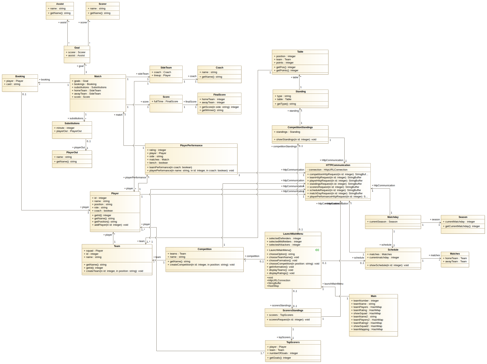
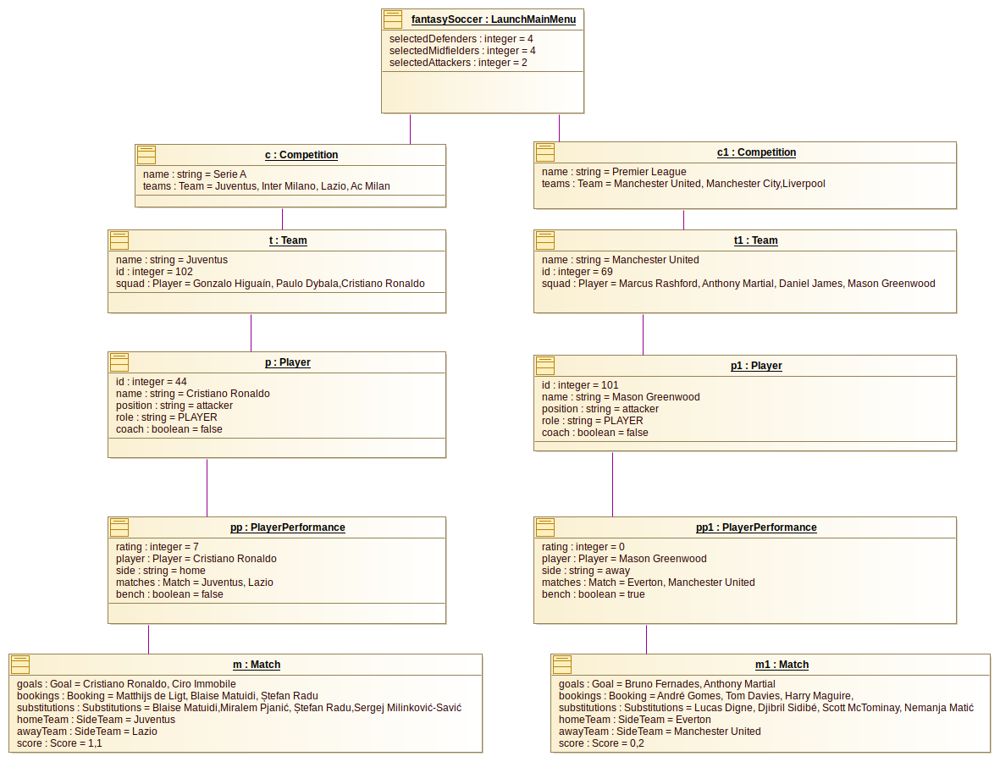
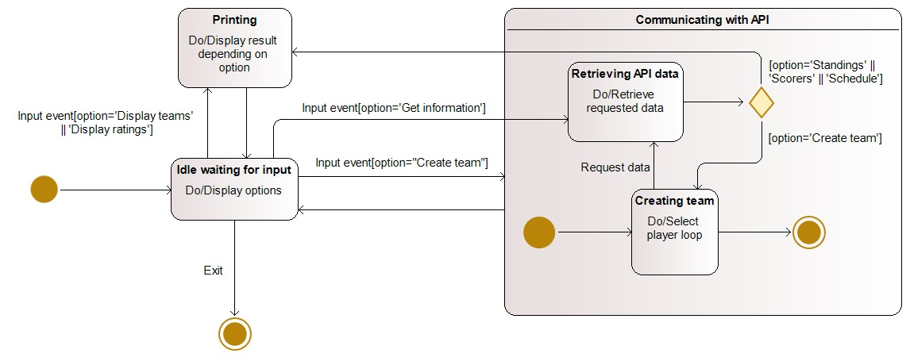
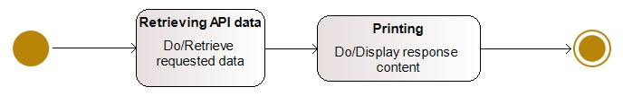
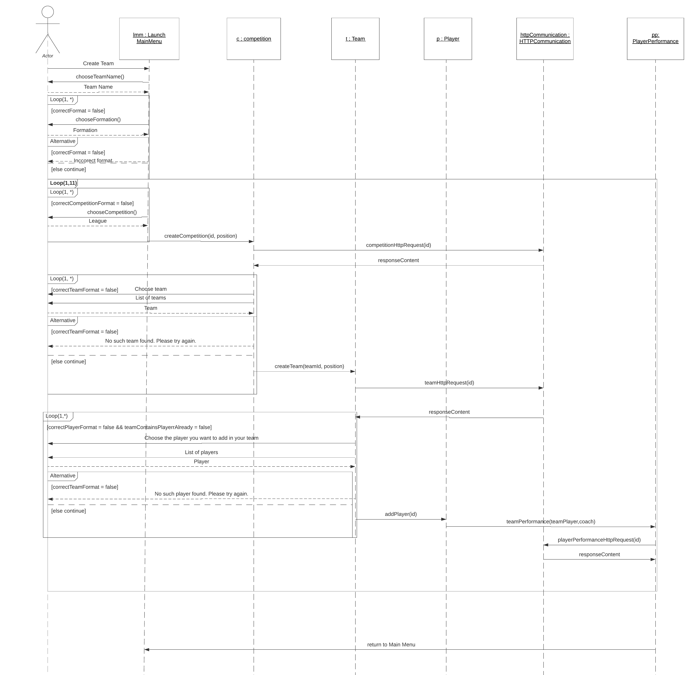
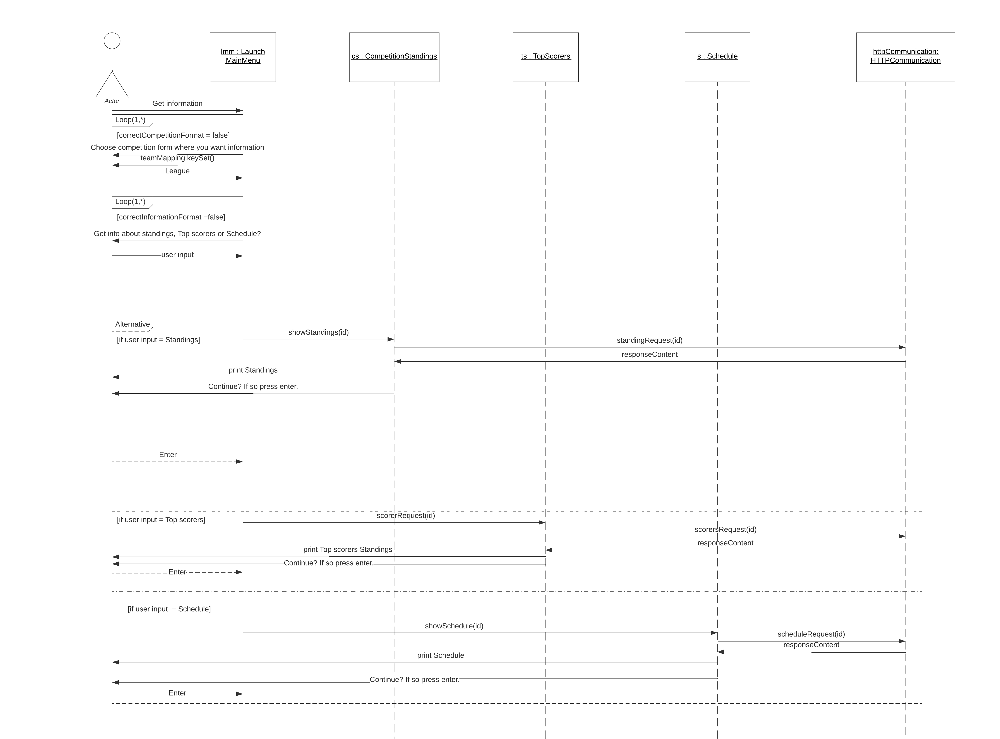

# Assignment 3

# Summary of changes of Assignment 2

- changed the names of classes, functions and attributes to be more descriptive

- made a special class for all the HTTP request

- address the issues with Assignment 1

- address the issues with the Class diagram, such as the multiplicity, the missing associations, missing classes and wrong names

- address the issues with the Object diagram and improve it by adding a more in depth example

- changed the state machine diagram as it was more an activity diagram

- improve the sequence diagram by adding the missing parts such as the guards

- the grammar issues have been solved

- the functions of the entire system have been reduced and grouped accordingly

- the list of quality requirements has been extended

- the format of the Team Formation has been changed accordingly, and the user has a wider spectrum of possible format

- the structure and protocol of the UML designs has been changed to follow the UML design conventions

  

# Class Diagram

Authors: Daniel, Radu

In software engineering, a class diagram in the Unified Modeling Language (UML) is a type of static structure diagram that describes the structure of a system by showing the system's classes, their attributes, operations (or methods), and the relationships among objects.

### **Main**

The **Main** class represents the starting point of the application, here the important attributes of the user’s team are stored, declared and defined, additionally in this class the Main Menu is created and generated such that the application will get into the starting phase of the application.

**Attributes:**

- *teamNumber*: This integer value is used in order to get the team number of both possible teams created, respectively when the first team was created it will have the *teamNumber* of 1, and sequentially the second team will have the *teamNumber* of 2.

- *teamName*: String that stores the team name of the first team created. 

- *teamName2*: Respectively, this String stores the team name of the second team created. 

- *teamPlayers*: This HashMap is used in order to map the whole first squad, for each individual player’s full Name and ID, ID that is used for further HTTP Communication if needed. 

- *teamPlayers2*: Similarly, this HashMap is used for a similar purpose as the previous attribute the only difference is that this attribute is mapping the name and the id for the second team. 

- *teamRating*: HashMap that stores the whole first squad’s name and their respective number of points (performance rating index) that are mapped accordingly.

- *teamRating2*: Accordingly, as the previous attribute this value maps the id with the points of each player for the second team created. 

- *showSquad*: This HashMap is used in order to show the first the team created and details such as name and the index are shown to the user. 

- *showSquad2*: Respectively, this attribute is used to print the details of the entire second squad. 

- *teamMapping*: HashMap that represents the mapping between the football leagues and their respective id, id that is used for further HTTP Communication with the API, if needed.

  

  This class is directly associated with the **LaunchMainMenu** class, the first instance of that class is generated in the **Main** Class.
  
  

### **Class LaunchMainMenu**

This class represents the main core of the entire application, here the main functionalities are implemented such as the creation of the team, getting relevant information about competitions, and displaying the rating of the teams. This class also calls the *HTTPCommunication* methods and operations several times, when the communication between the user and the API is needed.

**Attributes:**

*selectedDefenders*: integer: store the number of defenders the user's team has 

*selectedMidfielders*: integer: store the number of midfielders the user's team has 

*selectedAttackers*: integer: store the number of attackers the user's team has 

**Operations**:

~*LaunchMainMenu*() constructor: This constructor is used to initiate the entire application. When this constructor is called all the relevant functions are called subsequently, more specifically and first and foremost, the *chooseOption*() function is called, next, after the desired option has been chosen by the user, for instance the user chose the option “Create team”, the functions needed to create the team will be called such as, *chooseTeamName*(), *chooseFormation*(), and *chooseCompetition*() with the parameter of the desired position is called lastly. It starts by selecting a Goalkeeper for the team, 10 players that will fit the desired formation chosen by the user, and the Coach for the team. Otherwise, if the chosen option is “Get information” the *getInformation*() function will be called, other options available for the user are “Display teams”, “Display ratings” and “Exit”. 

*chooseOption*(): Public method that returns as a string the desired option chosen by the user to the LaunchMainMenu constructor, additionally it checks if the desired option is an available option.chooseTeamName: Public method which gets the user’s input and saves it as the name of the user’s created team.

*chooseFormation*(): Public method which represents the formation of the user’s created team, the first character will be the number of defenders, the sum of all integers in between the first and the last character will be the number of midfielders, and lastly the last character will be the number of attackers. For instance, if the desired formation is 4-2-2-2, the number of defenders will be 4, the number of midfielders will equal to 2+2=4, and the number of attackers will be 2. Additionally this function, like every other function of the program, has error-handling, for instance, it checks first if the total amount of players after the formation has been introduced is indeed equal to 10, also it checks for correct input format, for instance, 4/4/2 will be considered as the wrong format, and 4-4-2 will be the correct format. If the format or the total amount of players after the desired formation has been introduced, an error will be printed and the process will be restarted, therefore the user will have to introduce the formation again.

*chooseCompetition*(position: String): Public method which is responsible for the selection of the desired player, from a specific team and respectively from a specific competition, with a specific position, this method starts by showing to the user all the available competitions from which the user can choose his desired player. This method is directly associated with the HTTPCommunication Class, because in order to retrieve the competitions, teams and players specifically HTTP Requests to the API are required, therefore when such a connection is needed, the methods of the HTTPCommunication are inherited and called. This whole HTTP communication process is as follows, a specific request is sent to the Football API and the response content is parsed and converted from JSON to a JAVA object, and further processed. For instance, when the user wants to see all available teams from a specific competition, let’s say, Premier League, the teamHttpRequest method, which was inherited from the HTTPCommunication class, is called and a response is retrieved in JSON Format which will represent all the teams, and therefore shown to the user. Additionally, this method has error-handling, and always checks if the desired player chosen by the user is a valid player, furtherly the same goes for the desired team and competition. Also, this method takes into consideration the formation chosen before-hand and if the formation was, for instance, 4-4-2, the user will have to choose 4 defenders, 4 midfielders and 2 attackers.

*getInformation*(): This public method represents the possibility for the user to get the relevant information about specific competitions, teams and players.

*displayTeams*(): Public void method which shows the created teams in a detailed view. It shows the players that are part of the team and in which position they are playing.

displayRatings(): Public void method that displays the ratings of each player from each team and the total amount of points of each team. In addition, a message that shows the winner out of the two created teams is displayed on the terminal.

## Create team branch

### Competition

This class is part of the Create Team branch of the program. In this class, all the teams that participate in the league that the user choose are displayed and stored in the variable *teams*. The method *createCompetition*() is called from the **LaunchMainMenu**. Also, the function *competitionHttpRequest*(*id*) ,that is part of **HTTPCommunication** is called in order to get the teams inside that league. 

**Attributes**:

*teams*: *Team*[]: Variable that stores in an array of *Team* all the teams that are part of that league.

*name*: string: Variable that is used by the method *getName*() to output the name.

**Operations**:

*getName()*: string : Function that is called in order to display the team names that are part of that league 

*createCompetition*(*id*: integer, *position*: string): void : Public void method which gets from the API the teams participating in the league in JSON Format, stores it and prints it as a string on the terminal. Ask the user to input the wanted team via the terminal. Additionally, this method has error-handling, the user input is checked and the user is asked again if the wrong input is given.

### Class Team

This class is the second part of the Create Team branch of the program. In this class, all the players that are part of the team chosen by the user are displayed and stored in the variable *squad*. The method *createTeam*() is called from the **Competition** class. Also, the function *teamHttpRequest*(*id*) ,that is part of **HTTPCommunication** is called in order to get the players part of the team. 

**Attributes**:

*squad*: *Player*[]: Stores all the player which are part of the chosen team as *Player* type.

 *id*: integer : Variable that is used by the method *getId*().

*name: string*: Variable that is used by the method *getName*().

**Operations**:

*getName()*: string : Method used to return the name of the player

*getId*(): integer :  Method used to return the id of the player

*createTeam*(*id*: integer, *position:string*): void : Public void function which gets from the API all the players that are part of the team in JSON Format, stores it and prints it as a string on the terminal. Asks the user to input the wanted player. The input is protected by error-handling, meaning that the user will be asked again if his input is wrong.

### Class Player

This class is the third part of the Create Team branch of the program. In this class, the selected player from the team is stored in the *showSquad* variable that is part of the **Main** class. All the information about that player is fetched via the *playerHttpRequest* from the API. This function is a part of the **HTTPCommunication** class.

**Attributes**

*id*: integer : stores the id of the player used by the API and by the *getId*() method.

*name*: string : stores the player's name, used by the *getName*() method.

*position*: string :  player playing position, used by the GetPostition() method.

*role*: string : stores the role in the team, coach or player.

*coach*: boolean : variable used for telling the application that the user is selecting the coach, not a player.

**Operations**:

*getId*(): integer : Method used to return the player's or coach's Id.

*getName*(): string : Method used to return the player's or coach's name.

*getPosition*(): string : Method used to return the player's position, if a player

*addPlayer*(id: integer): void : Public void function which stores the player or coach in the user's team. This method gets the information from the API as JSON Format, stores it and furthermore calls the next function that is part of the **PlayerPerformance**.

### Class PlayerPerformance

This class takes care of awarding points to the players and coach that are part of the user team. All the needed information is fetched from the API using the function *playerPerformanceHttpRequest*() that is part of the **HTTPCommunication** class. 

**Attributes**:

*rating*: integer : stores the total amount of points the player or coach received.

*player*: Player : has all the details of the player that the app is analyzing the performance.

*side*: string : stores if the player/coach is part of the home or away team.

*matches*: Match[] : stores all the match information.

*bench*: boolean : variable used to show if the player is part of the starting lineup or not.

**Operations**:

*teamPerformance*(coach: boolean) : Iterates through the whole user team and call the *playerPerformance*() for each player or coach.

*playerPerformance*(name: string, id: integer, coach: boolean): void : Public void function which calculates the player or coach performance from the last game. The rating is given at the end and is stored in a *teamRating* HashMap, which is part of the **Main** class

### Class Match

This class stores all the information about the previous match played by the player or coach. It is a connection class made of all the variables needed to make the rating.

**Attributes**:

*goals*: *Goal*[] : stores the information about the goals scored such as the scorer and the player that assist

*bookings*: *Booking*[] : stores the information about the bookings, such as the type and the name

*substitutions*: *Substitutions* : store the information about the substitutions such as the names and the minute

*homeTeam*: *SideTeam* : the name of the home team

*awayTeam*: *SideTeam* : the name of the away team

*score*: Score : stores the score of the match

### Class Goal

Class used to get the information about who scored or assist in that match, used to get the JSON data from API about goals.

**Attributes**:

*scorer*: Scorer : has the information about the scorer.

*assist*: Assist : has the information about the player that assist.

### Class Scorer

Class that has detailed information about who scored in that particular match.

**Attributes**:

*name*: string : the name of the scorer.

**Operations:**

*getName*(): string : method to get the name of the scorer.

### Class Assist

Class that has detailed information about who assisted in that particular match.

**Attributes**:

*name*: string : the name of the player that assisted.

**Operations:**

*getName*(): string : method to get the name of the player that assisted.

### Class Booking

Class that has all the details about all the bookings in that particular game, used to get the JSON data from the API about bookings.

**Attributes**:

*player*: Player : has the information about the booked player

*card*: string : give the type of the card as a string, "RED" or "YELLOW"

### Class Substitutions

Class that has all the details about all the substitutions made in that particular game, used to get the JSON data from the API about substitutions.

**Attributes**:

*minute*: integer : give the minute when the player was substituted.

*playerOut*: PlayerOut : has the information about the player that is going out of the field.

### Class PlayerOut

Class that has the name of the player which is substituted. Used to get the name from JSON.

**Attributes**:

*name*: string : name of the player.

**Operations:**

*getName*(): string : method to get the name.

### Class SideTeam

Class that has the information about a particular team that played in that match.

**Attributes**:

*coach*: Coach : variable with the information about the team's coach

*lineup*: Player[] : the lineup of all the players that were in the starting 11 of that match

### Class Coach

Class that contains the name of the Coach. Used to get the name from the JSON.

**Attributes**:

*name*: string : name of the coach.

**Operations:**

*getName*(): string : method that returns the name.

### Class Score

Class that has information about the match's score.

**Attributes**:

*fullTime*: FinalScore : variable that contains the match information

### Class FinalScore

**Attributes**:

*homeTeam*: integer : score of home team

*awayTeam*: integer : score of away team

**Operations:**

*getScore*(side: string): integer : method to get the score for any of the teams, giving as a value the side.

*getWinner*(): string : returns the winner of the match.

## Get information branch

### Class Schedule

This class, first option of Get information when the user selected "Schedule". The schedule from the selected league by the user is outputted. The function *scheduleRequest*(), part of **HTTPCommunication** class is used to fetch the data from the API. 

**Attributes**:

*matches*: Matches : variable that has the information about each match from the next matchday.

*currentmatchday*: integer : stores the current match day of that league

**Operations:**

*showSchedule*(id: integer): void : public function that calls the function *getMatchDay*() part of **Matchday** class, in order to get the current matchday, and request the information about the next matchday. All the following matches from that particular league are displayed to the user.

### Class Matches

Class that stores the information about each match from that matchday.

**Attributes**:

*homeTeam*: Team : variable that stores the information about the home team

*awayTeam*: Team : variable that stores the information about the away team

### Class Matchday

Class used to get the current matchday of the selected league by using the API.

**Attributes**:

*currentSeason*: Season : variable used to store the information about the current season of that competition

**Operations:**

*getMatchDay*(id: integer) : method used to get the *matchday* of the current season,  by calling the function *matchDayRequest*(), which is part of the **HTTPCommunication** class. Furthermore,  using the class **Season** to return the *currentMtachday* to the **Schedule** class.

### Class Season

Class used to store the information and convert the data from JSON.

**Attributes**:

*currentMatchday*: integer : the variable that stores the actual matchday

**Operations:**

*getCurrentMatchday*(): integer : function used to return the matchday.

### Class CompetitionStandings

This class is part of the second option of Get information, when the user selected "Standings".  The standings from the selected league by the user are outputted. 

**Attributes**:

*standings*: Standing[] : variable that has all the data about each team in the standings such as the name or position.

**Operations:**

*showStandings*(id: integer): void : public void function that fetches data from the API by calling the method *standingsRequest*(), giving in JSON format the data about the standings in that particular league. The standings are displayed in the terminal in order showing the amount of points each team has.

### Class Standing

Middle class used to fetch the correct data from the API. 

**Attributes**:

*type*: string : variable that is part of the API, that describes the type of standings.

table: Table : variable where the data about the standings is stored.

**Operations:**

*getType()*: string : returns the type of the standings.

### Class Table

Class that has all the information about the teams in the standings. All the variables are used to get the JSON data from the API.

**Attributes**:

*position*: integer : store the current position of the team in that league

*team*: Team : all the information about the team in question, such as the name

*points*: integer : the amount of points the team has

**Operations:**

*getPos()*: integer : returns the current position.

*getPoints*(): integer : returns the amount of points.

### Class ScorersStandings

This class is part of the third option of Get information, when the user selected "Top scorers".  The top scorers from the selected league by the user are outputted.

**Attributes**:

*scorers*: Scorers[] : store the information about all the top scorers from that league

**Operations:**

*scorersRequest*(id: integer) : void : Public void method that fetches the data by calling the scorersRequest() part of the **HTTPCommunication** class and prints the list of top scorers on the user's terminal.

### Class TopScorers

This class gets all the details about each top scorer of the league.

**Attributes**:

player: Player : all the details about the player in question.

team: Team : all the information about the team for which the footballer plays for.

numberofGoals : Integer : stores the amount of goals scored.

**Operations:**

*getGoals*(): Integer : method which returns the number of goals scored by that player.

### Class HTTPCommunication

This class takes care of all the requests to the API that are needed by the Application in order to get the needed data. All the request need the variable *connection* in order to communicate with the API. The request to use a special Id that is needed for each particular request in order to give us what we are looking for.

**Attributes**:

*connection*: HttpURLConnection : variable used to communicate with the API

**Operations:**

*competitionHttpRequest*(id: integer): StringBuffer : public method, which returns a StringBuffer. It contains the data from the API about which teams that part in that competition. The variable id, is the competition's *id*.

*teamHttpRequest*(id: integer): StringBuffer : public method, which returns a StringBuffer. It contains the data from the API about which players are part of that team. The variable id, is the teams's *id*.

*playerHttpRequest*(id: integer): StringBuffer: public method, which returns a StringBuffer. It contains the data from the API about the player the user selected. The variable id, is the player's *id*.

*standingsRequest*(id: integer): StringBuffer : public method, which returns a StringBuffer. It contains the data from the API about the standings in the selected league. The variable id, is the competition's *id*.

*scorersRequest*(id :integer): StringBuffer : public method, which returns a StringBuffer. It contains the data from the API about the top scorers in the selected league. The variable id, is the competition's *id*.

*scheduleRequest*(id: integer): StringBuffer : public method, which returns a StringBuffer. It contains the data from the API about the schedule in the selected league. The variable id, is the competition's *id*.

*matchDayRequest*(id: integer): StringBuffer : public method, which returns a StringBuffer. It contains the data from the API about the matchday in the selected league. The variable id, is the competition's *id*.

*playerPerformanceHttpRequest*(id: integer): StringBuffer : public method, which returns a StringBuffer. It contains the data from the API about the previous match played by the footballer in the selected league. The variable id, is the player's *id*.

# Object diagram 

Authors: Daniel, Radu Florea

The object diagram displays the status in the system when the user adds players in their team. The user has selected the formation at the beginning of the system 4-4-2. This is converted into *selecteddefenders* , *selectedmidfielders* and *selectedattackers* as 3 separated integers. The user is choosing two attackers based on the choice of his team formation that has 2 forwards. 

In the diagram we can see that he has chosen as his first choice the Serie A league, then he receives a number of teams from that league which are stored in the variable *teams* of type Team. He chooses Juventus out of those teams. Furthermore, the user gets all the forwards from Juventus and he chooses Cristiano Ronaldo as his first attacker. All the information about Ronaldo is stored in the **Player** class such as his position, role and ID in the API. Furthermore, the **PlayerPerformance** class stores the number of points the player got in the last match played. In order to get that information, the class **Match** has the details needed of the previous match in order to give the player the points such as the scorers, the *bookings* or *score*. In our example, Cristiano Ronaldo was one of the scorers, and because of his performance, he got a *rating* of 77 as it can be seen in the **PlayerPerformance**.

Going into the next state, he has on more attacker to choose. He starts again the process by choosing the Premier League, then Manchester United and finally Mason Greenwood as his final choice for his attack. Then, his rating is stored in **PlayerPerformance** using the class **Match** that has all the needed variables to calculate his rating. In our example, Mason Greenwood was on the bench the whole game, so he got a rating of 0. This is known from the variable *bench*, which is equal to true.

# State machine diagrams

Author: Anton Kolkma

### **FantasySoccer**

The **FantasySoccer** class is the main class of the program where it deals mostly with the relationship between user input and communicating with the football API. When a FantasySoccer object is created, it starts in an initial state called 'Idle waiting for input'. Once entering this state the program will output the available options to the user, the options being: 'Create team', 'Get information', 'Display teams', 'Display ratings', and 'Exit'. If the user inputs the 'Create team' option, the system state transitions to a composite state named 'Communicating with API', which consists of 2 substates named 'Creating team' and 'Retrieving API data'. First, the state transitions to the 'Creating team' substate, in which the program asks the user multiple questions to narrow the player choice. Each question will request data from the API, marked by the transition to the 'Retrieving API data' substate. When the data is retrieved, it enters a choice pseudostate where the next state depends on the guards. Since the initial option was to create the team, its respective guard is evaluated to be true and we return to the creating team substate. These substate transitions happen continually for each player until the team is full, then the substate transitions to the finished state. Once finished, the state transitions back to the initial 'Idle waiting for input' state. If the user inputs 'Get information', the program then asks specifically which information such as 'Standings', 'Scorers', or 'Schedule'. Once the choice is locked in, the state transitions into the Retrieving API data substrate as described before. Once data is collected, it comes to the choice pseudostate again except the guard for information is evaluated to be true and it transitions to a Printing state outside of the composite state. This state displays the requested data on the terminal, once completed it transitions back to the initial idle state. If the input was 'Display teams' or 'Display ratings', the program simply transitions to the printing state and displays whichever option was specified, then returns to idling. Finally, the 'Exit' option brings the object to the final state.

### CompetitionStandings

The **CompetitionStandings** class is a small class in which an object is created if the user wishes to get information about the current standings of teams in a particular league. Initially, it is in the 'Retrieving API data' state where it completes the activity found in its name, then transitions to a printing state. Here the program will output either the correct data or an error message, which when completed will transition to the final state of the object.

# Sequence diagrams

Author: Radu Florea

When the program is executed, there are 2 possible paths to be followed. The first one is “Create team” and the second one is “Get information”. Accordingly, the program flow differs.

### Create team sequence

If the user wants to create a team at the beginning of the execution, basically this diagram will be behind the stream:

First of all, there are 6 classes and 1 actor in this diagram. Those components will be interacting with each other during the execution. “Actor” is the user/player.

The interaction starts with the user choosing the option, which in our case it is "Create team". This option is sent to the class **LaunchMainMenu**, that calls the method *chooseTeamName*(), asking the user for a team name. After the team name is chosen, the method *chooseFormation*() is called and asks the user to input a team formation in the correct format. This user input method is in a loop with condition that will be break when the formation choose is of the correct format. As long as the user enters a wrong formation, a message would be outputted telling him the problem. 

Going further, the program enters a loop going from 1 to 11, in which the user is going to choose the players he wants to have in his team. Inside this loop, a new loop is entered with a condition. In this loop, the method *chooseCompetition()*, asks the user to input the League in which the player he wants is playing. As long as the user enters a wrong input, the loop would not be broken and the user would be asked to input again a League until a correct input., which triggers the function *createCompetition*() inside the Competition class. From there, a new method is called, *competitionHttpRequest*(), which is part of the **HTTPCommunication** class that returns the *responseContent* that has all the teams participating in the chosen League. 

Furthermore, a new loop is entered that has a condition of input format. The user is asked to input the team out of the list of teams that were outputted in the terminal. The alternative statement that is inside the loop, will output a message telling the user the input is wrong and ask to try again, looping back to the list of teams. When the user enters the correct input, the else part of the alternative statement is triggered calling *createTeam*() method of the class **Team**. This method, calls the function teamHttpRequest(), part of the **HTTPCommunication** class that returns the *responseContent*. Inside this variable, the list of players of the chosen team is stored. This list is outputted to the user and asked to choose a player out of it. This statement is again in a loop with the condition of user input format. After the user input, the alternative statement is entered verifying the input. If the input is not correct, an error message is outputted asking the user to try again, looping back to the list of players. When the user enters a correct input, the function *addPlayer*() is triggered, which furthermore triggers the function teamPerformance() that is part of the **PlayerPerformance** class. Inside that method, the *playerPerformanceHttpRequest*() function is called, which returns the *responseContent*. 

Afterwards, when the function *teamPerformance*() is finished, we loop back to the main loop in order to add a new player. After adding 11 players, the would break and the program would go back to the Main Menu.

### Get information sequence

If the user wants to get information about the fixture at the beginning of the execution, basically this diagram will be behind the stream:

First of all, there are 5 classes and 1 actor in this diagram. Those components will be interacting with each other during the execution. “Actor” is the user/player.

The interaction starts with the user choosing the option, which in our case it is "Get information". This option is sent to the class **LaunchMainMenu** and the program enters in a loop with a condition of user input format. The user is asked to choose a competition from where he wants information and all the possible competitions are outputted to the user's terminal. The user would input the wanted competition, however, if the input is not correct, it would loop back, the possible competitions are printed again and the user has to try to enter again the competition. 

Afterwards, a new loop is entered that has again a condition of user input format. The user is asked what type of info he wants such as standings, top scorers or schedule. The user input is again tested, and as long as the input is not of the correct format, it would loop back to the type of info question. After the input is corrected, an Alternative statement is entered composed of 3 if statements based on the input.

Firstly, if the input is "Standings", the method *showStandings*() is called that is part of the class **CompetitionStandings**, which calls the function *standingRequest*() part of the **HTTPCommunication** class. This function returns the *responseContent* back into the function *showStandings*(), where the standings are printed alongside a message to press Enter when the user wants to continue. The user input is waited by the program in order to exit the alternative statement. 

Secondly, if the input is "Top Scorers", the method *scorerRequest*() is called that is part of the class **TopScorers**, which calls the function *scorersRequest*() part of the **HTTPCommunication** class. This function returns the *responseContent* back into the function *scorerRequest*(), where the top scorers are printed alongside a message to press Enter when the user wants to continue. The user input is waited by the program in order to exit the alternative statement.

Thirdly, if the input is "Schedule", the method *showSchedule*() is called that is part of the class **Schedule**, which calls the function *scheduleRequest*() part of the **HTTPCommunication** class. This function returns the *responseContent* back into the function *showSchedule*(), where the schedule is printed alongside a message to press Enter when the user wants to continue. The user input is waited by the program in order to exit the alternative statement. 

# Implementation

Authors: Daniel Istratii, Radu Florea

Moving from the designing/modelling phase to the actual implementation was by following what classes, objects, state machines, and sequence diagrams we initially had in mind, additionally with all the attributes and operations with their specific data type, value, and functionality. However, in some cases, our implementation did not know according to our initial design, and therefore some parts had to be rethought and implemented again. For instance, we had encountered several problems while extracting data from the Internet using the Football API. We would like to mention that the API we used is the following one: https://www.football-data.org/, and our Application will work only with a valid subscription for this Football API, for the moment the user is using our own paid subscription, but in the future if the application will be used, a paid subscription will indeed be necessary.

The transition was easy as we could divide the application into two distinct parts, “Create team” and “Get information”. This helps us to spread the task of constructing the code much better as we could work on both tasks at the same time.

Firstly, two of our members have started with the “Create team” branch of the system, implementing it and debug it in order to have our first working segment of our App.

Secondly, the other two members started working on the other branch, however, encountered some problems with linking the API, so they start looking for design ideas for the GUI part of the project. When the first segment was done, we all met and found out the problem with the API and continued with implementing the second segment of the code in order to meet the deadline.

After getting the feedback from Assignment 2 and moving into the next part of our implementation, we have changed the strategy of implementation. We try to start by optimizing the code we already have, making it shorter and better written. Afterwards, we started implementing the main feature of our project, the fantasy points that should be received by the players base on the performance from the previous match. This was a hard task as we had to get data about the previous match and try to filter it in order to get the wanted details from that match.

Finally, having the system in place to give player points, we focused more on the menu of the application. We added some new features such as storing more than one team, displaying the teams in detail or comparing the two created teams base on their fantasy scores. We wanted to highlight that we were going to implement a GUI part, but having a problem with one of our team members leaving us, we did not have enough time to implement everything we had in our plan.

### **Key solutions**

We base our project on getting the data from the Football API, meaning that we first read the format of the data (as JSON) that we got and try to parse and interpret it accordingly. The “Get information” section is all about getting the correct information that is asked by the users, manipulating that data and display it in a nice format in order for the user to be able to read it. We manage to do this by storing in classes and variables each important part of data we are looking for and printing them on the terminal in this phase, but we would like to extend our application’s user experience by providing a basic GUI.

### Main class

The **main** class of the Application can be found in Software-Design/src/main/java/Main.java as a directory and as a [link](https://github.com/daniel-istratii/Software-Design/tree/Assignment-2/src/main/java).  

This class, **main** starts with the declaration on multiple hashmaps that will store the user's team and the possible football leagues from where the user can look for players, in addition to a string variable that store the team name. After that, the leagues are added in the hashmap for future use. Finally, the FantasySoccer class is initialized and its' function is called to start the app.

### Jar file

The Jar file for directly executing the code can be found in Software Design/out/artifacts/software_design_vu_2020_jar/software_design_vu_2020.main.jar or as a [link](https://github.com/daniel-istratii/Software-Design/blob/Assignment-3/out/artifacts/software_design_vu_2020_jar/software-design-vu-2020.main.jar).

### **Video**

We have created two videos to show the functionalities of our Fantasy Soccer app. The videos are posted on our Youtube and can be accessed via the links.

The first video: https://youtu.be/wzHKu9zgEac , we present how the user can create a team and the steps in order to add a player to his team. Then, we show how the user can see his team or see the amount of points his team gets.

The second video: https://youtu.be/xZCjOdGPfJc , we show how the "Get information" section works and what the player can find out about his favourite football league. In our example, the user checks the top scorers in Premier League, then the standings in La Liga.

### Assignment 1 feedback

We made the changes to assignment 1. It seems that we uploaded the wrong document last time with just a few modifications. We had a document that had more changes and it was our mistake. The quality requirements have been modified. The correct Assignment 1 can be found inside the folder docs in branch assignment 3 or [here](https://github.com/daniel-istratii/Software-Design/blob/Assignment-3/docs/assignment1.md).

